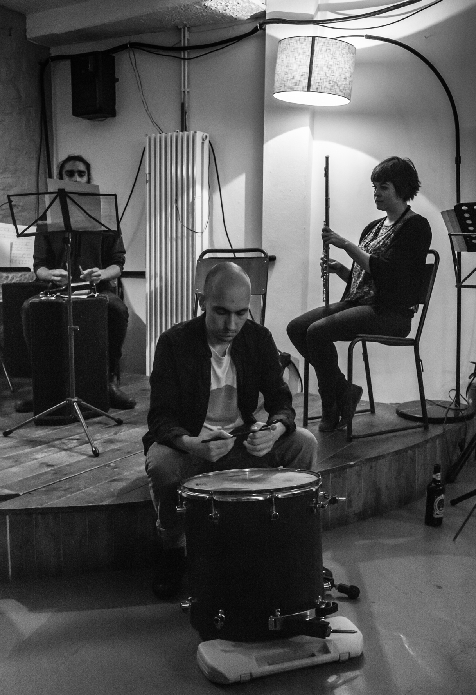

 in the first year of my PhD in HCI at the University of Bristol, studying with Anne Roudaut and Oussama Metatla. I hold an MSc in Computer Science (Distinction) from University of Bristol, and an MA in Philosophy (Distinction) from University of Southampton.

I have pages on [**twitter**](https://twitter.com/__stillPoint), [**github**](https://github.com/danBennettDev/), [**google scholar**](https://scholar.google.com/citations?user=KxrABMIAAAAJ&hl=en), and I have a [**newsletter**]({{site.baseurl}}/about/mailingList.html). You can contact me via my <a href='&#109;&#97;&#105;&#108;&#116;&#111;&#58;&#100;&#98;&#49;&#53;&#50;&#51;&#55;&#64;&#98;&#114;&#105;&#115;&#116;&#111;&#108;&#46;&#97;&#99;&#46;&#117;&#107;'>**email address**</a>, and you can see what I've been [**reading**]({{site.baseurl}}/reading/index.html). 

### Teaching and Work Experience

I run a series of additional support lectures for introductory C programming at University of Bristol, and I have assisted in teaching on modules for Databases, and Interaction Design. I am currently supervising a MSc student project. Previously I worked for several years as Information Systems Manager for a large NHS trust, doing a mixture of database management, project management, BI development & IT strategy.

### Music and Philosophy 

Before computing my academic background was in philosophy, and I still have an interest in this area, particularly ethics and philosophy of cognitive science. I also make music, which you can find [here]({{site.baseurl}}/music/music.html).

<!-- 
Performing Rishin Singh's *Stalaktos* at Cafe Kino, Bristol (photo by Bruno Guastalla) -->

<!-- 

<iframe src="https://player.vimeo.com/video/14901626" frameborder="0" class="ytvideo" allow="autoplay; encrypted-media" webkitallowfullscreen mozallowfullscreen allowfullscreen></iframe>

 -->