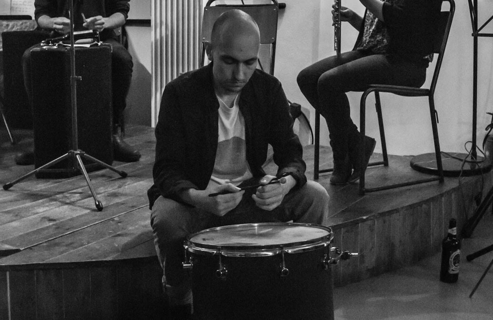



My research connects the two strands of my academic background - philosophy and computer science. I’m as interested in the ideas of thinkers like Heidegger and Gibson as I am in the possibilities of quantitative and computational approaches, and I don’t see the two approaches as incompatible. I am fascinated by ideas of cognitive embodiment, and how they might help us understand the ways interaction emerges from dynamic relations between human intention, the context and the material properties of the technology. I follow some recent cognitive science in seeing these ideas as a conceptual scaffold, which not only sensitises us to issues, but also provides a source of specific, testable, hypotheses. Ultimately I aim to develop metrics which might be put to use in computational systems, moving the embodied approach further into the substance of dynamic, adaptive technology.
<!-- like "readiness-to-hand", affordances and context-embeddedness, as a conceptual skeleton for understanding the dynamics of tool interaction. At the same time, I am interested in developing hypotheses from this conceptual skeleton, and fleshing them out with empirical research, based on modern approaches in embodied cognitive science. Ultimately I would like to see these results incorporated into into dynamic, adaptive technology. -->

Aside from this, I am a musician, and interested in tools for musical creativity. I have performed at venues around Europe, composed music for theatre and art installations, and I also develop and share software for music making. Before returning to academia, I worked as the ‘Information and Performance Systems Manager’ for a large NHS trust - doing a mixture of database management, project management, BI development & IT strategy.

I have pages on [twitter](https://twitter.com/__stillPoint), [github](https://github.com/danBennettDev/), [google scholar](https://scholar.google.com/citations?user=KxrABMIAAAAJ&hl=en) and I have a [newsletter]({{site.baseurl}}/about/mailingList.html), and an <a href='&#109;&#97;&#105;&#108;&#116;&#111;&#58;&#100;&#98;&#49;&#53;&#50;&#51;&#55;&#64;&#98;&#114;&#105;&#115;&#116;&#111;&#108;&#46;&#97;&#99;&#46;&#117;&#107;'>email address</a>
