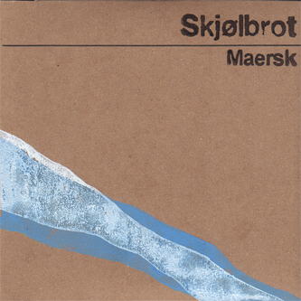

*"simultaneously beautiful, startling, and haunting"* - Foxy Digitalis

**Digital Download:** [Boomkat](http://boomkat.com/downloads/357844-skjolbrot-maersk)
**CDs:** sold out

**Video:**

<iframe src="https://player.vimeo.com/video/14901626" frameborder="0" class="ytvideo" allow="autoplay; encrypted-media" webkitallowfullscreen mozallowfullscreen allowfullscreen></iframe>

Skjølbrot - Rue Victor Masse to Gare d'Austerlitz on Vimeo.

**Reviews:**

**Boomkat:** Album of the Week/Highly Recommended - *"Amazing debut collection... a deeply engrossing and peculiar soundworld"*

**Fluid Radio:*** "Every piece... is an outstanding achievement and taken as a whole, really encompasses the epitome of cinematic sound art. Each work feeds off one another, building to a climax, on “Emma”, that will leave listeners speechless, and this writer, wordless. Getting there is quite a joy to behold."*

**The Wire:** *"There's an eeriness about the containerisation process, about the automation of the ports and the loneliness and of the ships, and this is what Maersk, with it's radio broadcasts, piano, electronics and half-erased field recordings, conveys so powerfully."*

**Freq:** *"the musical equivalent of a Mike Nelson installation, in which paradoxical clues scattered around uncanny locations encourage a kind of forensic examination, positioning the listener as a Lovecraftian detective attempting to trace the tracks left by someone or something that is at once human and altogether unknowable."*

<iframe width="55%" height="450" scrolling="no" frameborder="no" src="https://w.soundcloud.com/player/?url=https%3A//api.soundcloud.com/playlists/453374&auto_play=false&hide_related=false&show_comments=true&show_user=true&show_reposts=false&visual=true"></iframe>
